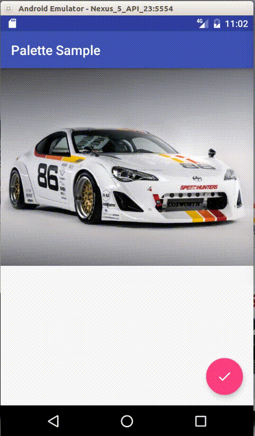

# Palette Library in Android



This is a sample project to demonstrate how to use `Palette API` in Android to extract color information from images and change the look and feel of the application dynamically.

## What is Palette ?

Palette is a library for color data extraction, which is part of the Android Support Library.

This library is part of the Material Design components and is created to help developers change the color and theme of the screen, based on the image content of the screen.

For a comprehensive tutorial on the Palette, please visit [Brian Gardner Article on BigNerdRanch.com](https://www.bignerdranch.com/blog/extracting-colors-to-a-palette-with-android-lollipop/)

## How to integrate ?

Palette is part of the Android Support Library project and can be integrated using the following dependency in build.gradle.
You should replace the version (25.1.0) with whatever the last version of android support library is.

```
dependencies {

    compile 'com.android.support:palette-v7:25.1.0'
}

```

## Using Palette to extract color data

1- You need an image file. As of the current project we have used a sport car image from the drawable resources.(R.drawable.sportcar)

2-You need to create a Bitmap object so that the Palette obejct can use it to make color computations.

3- Palette can make its computation both synchronously and asychronously. To move the heavy work off the ui thread, we have used the `Palette.PaletteAsyncListener` in the generate() method.

4- Palette categorizes the colors in the following way :

> Dominant
>
> Vibrant
>
> Muted
>
> Dark Vibrant
>
> Light Vibrant
>
> Dark Muted
>
> Light Muted

### Swatch

For every color profile in the last part, there is a swatch object in the Palette, namely getDominantSwatch(), which provides more details like :

> **Population** : The number of pixels having that color
>
> **TitleTextColor** : The suitable color to use against the current profile, for a title text
>
> **BodyTextColor** : The suitable color to use against the current profile, for a body text
